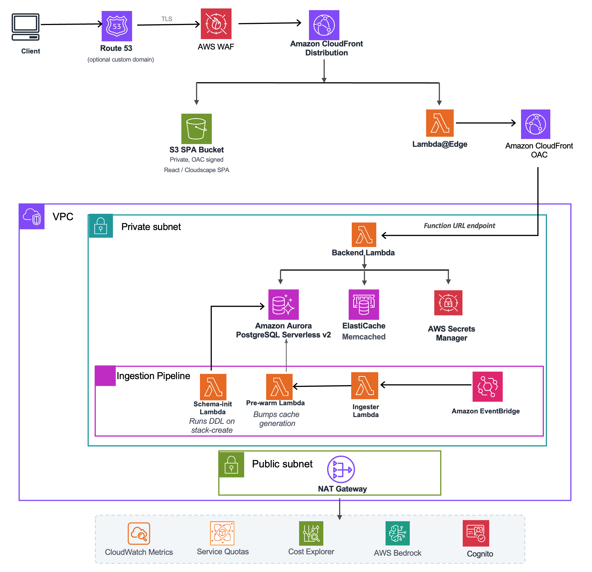
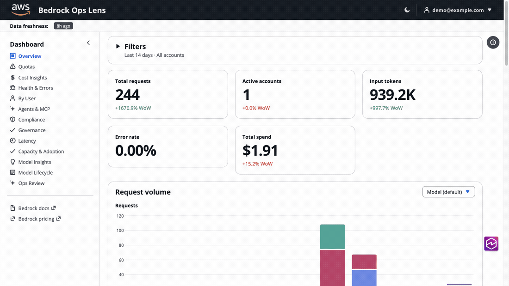
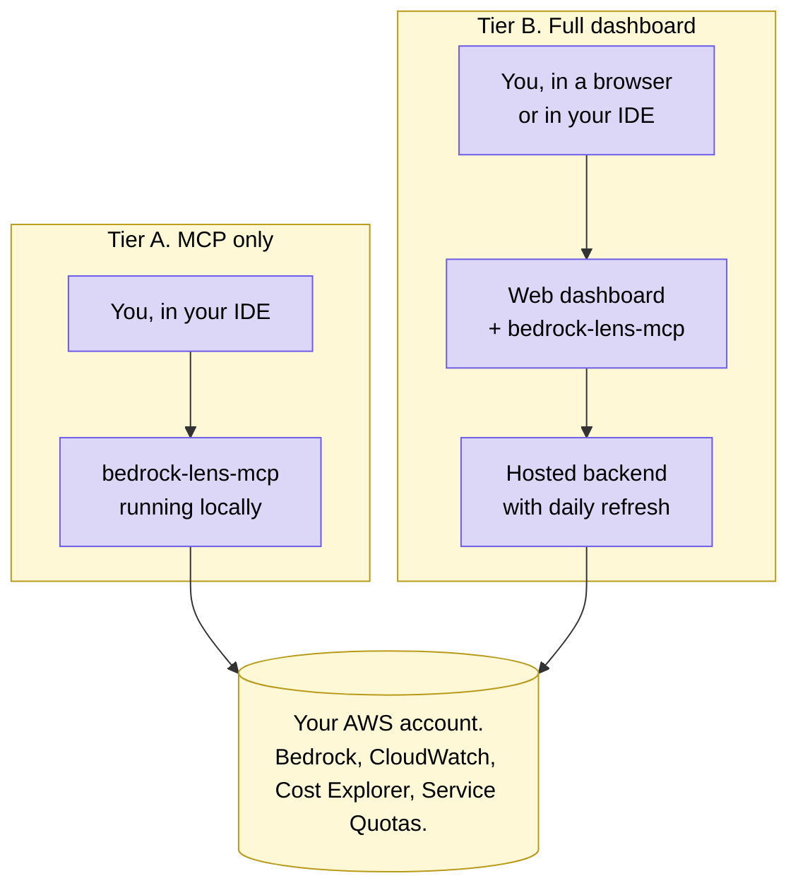

# Bedrock Ops Lens

A Bedrock observability dashboard you can deploy in your own AWS account, plus an MCP server that exposes the same data to Claude Code, Cursor, and Kiro (CLI or IDE).






## What it does

Cost Explorer rolls all of Bedrock into one line. CloudWatch is per-account. Invocation logs are JSON in S3. This dashboard joins those three signals so you can see per-account, per-model, per-tag attribution in one place. The MCP exposes the same data to your IDE, so you can ask the question instead of clicking through tabs.


## Two ways to use it



| Tier | Use it when |
|---|---|
| A. MCP only | You want quick answers in your IDE, no infrastructure. Cannot do heavy historical or tag-attributed work because there is no database. |
| B. Full dashboard | Finance, leadership, or anyone without AWS access needs the same insights. Includes the web UI and the MCP. |

Tier A is light. The MCP runs on your laptop and calls AWS APIs live. Useful for quick lookups but cannot do heavy historical work or per-tag cost attribution because there is no database behind it.

Tier B is everything else. The Cloudscape web dashboard, sign-in, CloudFront, daily ingester, Aurora, Memcached, and the same MCP wired up to talk to the hosted backend. Most teams deploy this so non-engineers can get the same insights without a terminal.


## Quick start

```bash
git clone https://github.com/aws-samples/sample-bedrock-ops-lens.git
cd sample-bedrock-ops-lens
cp config.example.yaml config.yaml      # then edit: deploy_region, monitored accounts/regions
ALLOWED_EMAIL_DOMAINS=yourcompany.com ./deploy.sh --yes
```

`config.yaml` is required (it drives the deploy region and which accounts/regions get monitored). Copy the example and edit it before deploying; the defaults work for a single-account, single-region setup.

The script handles everything: VPC, Aurora, Memcached, Cognito, CloudFront, WAF, schema, ingester, and a first ingest run. About 12 minutes. It prints the dashboard URL when done.

Open the dashboard URL and sign up. Anyone whose email domain matches `ALLOWED_EMAIL_DOMAINS` can create their own account; the first verified user is auto-promoted to admin.


## Wiring up the MCP

Install the MCP server first.

```bash
cd mcp
pipx install -e .
```

Pick the option that matches how you deployed.

<details>
<summary><b>Option 1. Tier A. No deployment, uses your local AWS credentials</b></summary>

Best for: a quick, solo setup. The MCP calls AWS directly.

```bash
claude mcp add bedrock-lens -- bedrock-lens-mcp
```

</details>

<details>
<summary><b>Option 2. Tier B, no password (recommended if you have AWS credentials)</b></summary>

Best for: anyone with AWS credentials who deployed the stack. Uses SigV4 signing so there is no Cognito password to manage.

```bash
FN_URL=$(aws cloudformation describe-stacks \
  --stack-name BedrockOpsLens-<suffix> \
  --query 'Stacks[0].Outputs[?OutputKey==`BackendLambdaUrl`].OutputValue' \
  --output text)

claude mcp add bedrock-lens \
  --env BEDROCK_LENS_FUNCTION_URL="$FN_URL" \
  -- bedrock-lens-mcp
```

</details>

<details>
<summary><b>Option 3. Tier B with a Cognito password (for users without AWS credentials)</b></summary>

Best for sharing access with someone who does not have AWS credentials. They sign in with email and password instead.

Set your credentials as environment variables first, then add the server. Do not commit the password.

```bash
export BEDROCK_LENS_API=https://<distribution>.cloudfront.net
export BEDROCK_LENS_USER=you@yourcompany.com
export BEDROCK_LENS_PASSWORD=...   # paste the password here, do not check it in

claude mcp add bedrock-lens \
  --env BEDROCK_LENS_API="$BEDROCK_LENS_API" \
  --env BEDROCK_LENS_USER="$BEDROCK_LENS_USER" \
  --env BEDROCK_LENS_PASSWORD="$BEDROCK_LENS_PASSWORD" \
  -- bedrock-lens-mcp
```

</details>

Then ask Claude something like:

> Run the bedrock-lens health check.

> What was our Bedrock spend last 30 days, and which day had the biggest jump?

> Are we using any models that are Legacy or about to hit EOL?

> Run an ops review of the last 14 days and summarize the top 3 issues.


## Daily refresh

After deploy, EventBridge invokes the ingester every day at 05:00 UTC. The ingester reads CloudWatch metrics, Cost Explorer, Service Quotas, Bedrock APIs, and Bedrock invocation logs from S3, then writes everything into Aurora and bumps the cache generation. Open the dashboard the next morning, yesterday's data is there.

Manual backfill if you change the schedule or want a fresh run:

```bash
aws lambda invoke \
  --function-name BedrockOpsLens-<suffix>-ingester \
  --invocation-type RequestResponse --cli-read-timeout 900 \
  /tmp/out.json
```


## Multi-account data pipeline

The central Lambda pulls Bedrock data from every account you point it at. One script does the whole thing: it deploys a read-only `BedrockOpsLensReader` role into each account via a CloudFormation StackSet, reconfigures the central ingester to use those roles, and triggers the first ingest run synchronously so you see real data immediately.

```bash
./setup-pipeline.sh --scope <single|ou|org-root|accounts> [opts]
```

For Cost Explorer, no per-account role is needed at all — the management account's Cost Explorer is org-aware natively and the central Lambda calls it once.

<details>
<summary><b>Option 1. Just my own account (single)</b></summary>

The simplest case. No StackSet. Reader role deployed to the central account itself; ingester pulls from this one account.

```bash
./setup-pipeline.sh --scope single
```

</details>

<details>
<summary><b>Option 2. All accounts under one or more OUs (recommended for orgs)</b></summary>

Service-managed StackSet, deployed to the OUs you list. Auto-deploy is ON, so accounts joining the OU later are auto-onboarded. Run from the management account, or pass `--delegated-admin` from a delegated administrator account.

```bash
./setup-pipeline.sh --scope ou --ou-id ou-xxxx-yyyyyyyy
```

For multiple OUs, comma-separate them.

</details>

<details>
<summary><b>Option 3. Whole org root</b></summary>

Same as option 2 but targets every account in the organization. Useful for small orgs where OU-scoping isn't worth it.

```bash
./setup-pipeline.sh --scope org-root
```

</details>

<details>
<summary><b>Option 4. Explicit account list (no AWS Organizations)</b></summary>

Self-managed StackSet. Doesn't require AWS Organizations, but each member account needs the AWS-provided `AWSCloudFormationStackSetExecutionRole` pre-provisioned (one-time, per the [AWS docs](https://docs.aws.amazon.com/AWSCloudFormation/latest/UserGuide/stacksets-prereqs-self-managed.html)).

```bash
./setup-pipeline.sh --scope accounts \
  --accounts 111111111111,222222222222,333333333333
```

Or via file:

```bash
./setup-pipeline.sh --scope accounts \
  --accounts-file accounts.txt
```

</details>

The script is idempotent — re-run any time accounts are added or removed. Use `--dry-run` to preview without touching anything, `--skip-ingest` to skip the post-rollout ingest run.

### What `setup-pipeline.sh` does

1. Validates the central stack exists (auto-discovers from `.deploy-stack-name`).
2. Calls `scripts/setup-multi-account.py` to roll out the reader role via the right CloudFormation API for the chosen scope (service-managed StackSet for `ou` / `org-root`, self-managed for `accounts`, plain stack for `single`).
3. Reconfigures `MONITORED_ACCOUNTS_MODE` on the central ingester Lambda (`discover-org` for `ou`/`org-root`, `explicit` for `accounts`, `single` for `single`).
4. Triggers one ingest run synchronously and prints the per-module summary.

After this, EventBridge fires the ingester daily at 05:00 UTC. Re-run the script any time the OU shape changes.

### Scale

Validated end-to-end up to ~100 accounts in one ingester Lambda. Past that, the central Lambda starts hitting CloudWatch (50 TPS) and Service Quotas (5 TPS) per-account API limits.

For larger orgs (200+ accounts), shard by OU and run one StackSet per shard, each producing its own ingester:

```bash
./setup-pipeline.sh --scope ou --ou-id ou-engineering-...
./setup-pipeline.sh --scope ou --ou-id ou-data-...
./setup-pipeline.sh --scope ou --ou-id ou-experimental-...
```

For very large customers (500+ accounts) the pull architecture becomes the wrong fit. Reach out and we'll point you at the push-mode pattern (CW Metric Streams → Firehose → S3 → central ingester).


## Dashboard tabs

| Tab | Answer |
|---|---|
| Overview | Total requests, accounts, tokens, error rate, spend in the window |
| Quotas | Applied versus default quotas, peak usage, severity-coded utilisation |
| Cost Insights | Real Cost Explorer dollars, daily trend, by-account and by-model breakdowns |
| Health and Errors | Errors by model, by account, daily and hourly trends |
| Latency | p50, p90, p99 by model |
| Capacity and Adoption | CRIS adoption, throttle rates, prompt caching opportunities, Claude 4 burndown risk |
| Model Insights | Per-model deep dive: requests, tokens, cache hit rate, errors, accounts |
| Model Lifecycle | Live ListFoundationModels joined with usage, timeline of legacy and EOL bands |
| Workloads | Per-workload usage, throttle, and latency — **requires a GenAI proxy** (see below). Also per-IAM-principal callers (from invocation logs) and per-project Mantle chargeback |
| By User | Per-caller attribution from invocation-log identity: by app/group (role), user (session), or full principal |
| Agents & MCP | AgentCore runtimes and MCP gateway tools: invocations, sessions, errors, latency, real billed cost |
| Compliance | Guardrails interventions by policy type, guardrail, and daily trend |
| Governance | Declarative registry (`db/registry.yaml`) reconciled against observed usage: compliant, drift, undeclared (shadow AI) |
| Ops Review | LLM-synthesized executive brief covering the top 3 issues |
| Settings | Auth identity, ingestion freshness, region and account scope, pinned tag keys |

Two notes on the By User tab. The "user" axis is the `sts:AssumeRole` session name, which the caller chooses — it is audit-grade only if you enforce it (IAM condition on `sts:RoleSessionName`, or IAM Identity Center federation, which pins it to the login); the "group" axis (the role itself) cannot be faked. And since it shows person-level usage to every signed-in dashboard user, check your organization's privacy requirements before enabling broad access.

Every tab except **Workloads** populates automatically from CloudWatch, Cost
Explorer, Service Quotas, and (optionally) model invocation logs — no
application changes required. The Workloads tab is opt-in and needs the setup
below.


## Workloads: per-workload attribution (optional)

The Workloads tab answers "which of my use-cases is driving Bedrock usage,
throttling, and latency" — attribution the AWS-native metrics can't provide,
because CloudWatch is keyed by model, not by your application's use-case.

It works only if you front Bedrock with a **shared GenAI proxy / gateway**
(LiteLLM, a Bedrock gateway, an internal SDK wrapper, etc.) that can tag each
call with a `workload`. If your apps call Bedrock directly with no common layer,
this tab stays empty (the rest of the dashboard is unaffected).

**How it works:** your proxy drops **one metadata-only event per request** to an
S3 bucket; the dashboard reads that bucket read-only (no inbound endpoint, never
sits in your request path). No prompt or response text ever leaves your proxy.

1. **Emit an event per request.** In your proxy, after each Bedrock call, append
   one NDJSON line to S3 under this exact layout (`.jsonl` or `.jsonl.gz`):

   ```
   s3://<your-bucket>/proxy-events/<region>/<YYYY>/<MM>/<DD>/<HH>/*.jsonl
   ```
   ```json
   {"ts":"2026-07-04T18:03:22Z",
    "dimensions":{"workload":"flights-search","env":"prod","business_unit":"travel"},
    "model":"anthropic.claude-opus-4-8","endpoint":"runtime","region":"us-east-1",
    "input_tokens":812,"output_tokens":143,"cache_read_tokens":0,
    "status":200,"throttled":false,"latency_ms":940,"request_id":"msg_..."}
   ```
   **`dimensions` is an arbitrary custom-attribute map** — attach whatever your
   org slices by: `workload`, `env` (prod/dev), `business_unit`, `cost_center`,
   `team`, feature flags, etc. The dashboard's Workloads tab lets you pivot by
   any key you emit (the picker top-left) and computes tokens, throttle rate,
   latency, **and per-value TPM quota utilization** for each. `workload` is just
   the conventional default key; a bare top-level `"workload":"x"` is still
   accepted for back-compat. `endpoint` is `runtime` or `mantle`. See
   **`tools/reference-proxy/`** for a working, copy-paste starting point.

2. **Grant the dashboard read access** — a bucket policy allowing the ingester
   role `s3:GetObject` + `s3:ListBucket` on `.../proxy-events/*` (read-only,
   cross-account supported).

3. **Deploy pointing at the bucket:**
   ```bash
   export PROXY_EVENTS_BUCKET=your-genai-proxy-events
   export PROXY_EVENTS_REGIONS=us-east-1,us-west-2   # regions your proxy partitions under
   ./deploy.sh --yes
   ```
   Leave `PROXY_EVENTS_BUCKET` unset to disable the tab entirely. The daily
   ingester reads new events into the per-dimension views; no synthetic data is
   ever generated — the tab shows only what your proxy emits.

**Transport note (S3 vs CloudWatch).** The event *shape* above (the `dimensions`
map + token/status/latency fields) is transport-agnostic. Today the shipped
emitter and ingester use **S3 NDJSON** — chosen for the simplest cross-account,
read-only access and the cheapest way to carry arbitrary high-cardinality
attributes (no per-metric cost). Two CloudWatch alternatives are pluggable
future readers if a customer needs near-real-time or already centralizes on CW:
- **CloudWatch Logs (structured JSON)** — same arbitrary fields, per-GB pricing
  (no cardinality tax), Logs-Insights queryable; would add a cross-account
  subscription/Insights ingestion path feeding the *same* `f_proxy_dim_hourly`
  tables. Near-real-time.
- **CloudWatch custom metrics (`PutMetricData` Dimensions)** — true 1-minute
  granularity, but each unique dimension-value combination is a separately
  billed custom metric, so it only suits a *small, fixed* set of dimensions
  (e.g. `workload` alone), not open-ended attributes like `cost_center`.

Either would reuse the entire data model, aggregation, quota math, and UI built
for the S3 path — only the reader changes. Not implemented today; S3 is the
supported transport.

**Why the proxy path, given AWS-native cost attribution exists.** AWS ships
several native attribution mechanisms
([Bedrock cost management](https://docs.aws.amazon.com/bedrock/latest/userguide/cost-management.html)):
IAM principal attribution, Application inference profiles (runtime), and
Projects / Workspaces (mantle). We use the native building blocks where they
fit — per-request metadata tags feed the tag-filtered views, the identity ARN
feeds "Top callers", and the Mantle Project dimension feeds per-project
chargeback. But every *native* method outputs **billed dollars, aggregated per
usage-type per day** to Cost Explorer / CUR 2.0 — none of them emit **throttle
rate** or **TPM quota utilization**, and the profile/principal methods don't
cover the `bedrock-mantle` endpoint. The Workloads (proxy) path is the only one
that gives per-workload **usage** — tokens, throttle %, latency, and quota
utilization — uniformly across both endpoints and at ~hourly (not 24–48h)
freshness. So: use native attribution for **dollars by workload** (surfacing
inference-profile / Project cost from Cost Explorer is a planned fast-follow);
use the proxy path for **usage / throttle / quota by workload**. The proxy event
`dimensions` map intentionally mirrors AWS's `requestMetadata` custom-attribute
shape (`{team, tenant, cost_center, …}`), so it's an extension of the native
pattern, not a fork.

**No-proxy path for usage-by-attribute (AWS-native).** AWS's
[request-level usage attribution](https://aws.amazon.com/about-aws/whats-new/2026/05/amazon-bedrock-request-level-usage-attribution/)
lets you tag each `InvokeModel` / Converse call with arbitrary
`requestMetadata` attributes (`team`, `project`, `environment`, …) and analyze
**token usage** by those tags in model invocation logs. **This dashboard already
ingests it** — the invocation-log ingester parses `requestMetadata` into
`f_daily_tagged`, and the "Pinned tag keys" setting surfaces any tag as a
top-bar filter. So a customer who already runs invocation logging gets
usage-by-attribute with **zero proxy work**. Its limits (the reason the proxy
path still exists): it's `bedrock-runtime` only (no Mantle invocation logs),
requires invocation logging enabled, is daily-batch, and exposes token counts
but **not throttle rate or TPM quota utilization** (throttled calls are often
not logged; quota headroom isn't in the logs). The proxy path adds those three
and covers Mantle. Same custom-attribute model, two complementary sources.


## Cost

Idle, with Aurora paused, the stack runs around fifty dollars per month. NAT Gateway is the largest fixed cost at about thirty-two. Aurora is between zero and forty-five depending on activity. ElastiCache Memcached is about thirteen. Lambda, CloudFront, S3, Cognito, and WAF together are around five.


## Verify

```bash
DASH_URL=$(aws cloudformation describe-stacks \
  --stack-name BedrockOpsLens-<suffix> \
  --query 'Stacks[0].Outputs[?OutputKey==`DashboardUrl`].OutputValue' \
  --output text)

curl -sf "$DASH_URL/api/health"
```

For end-to-end UI validation:

```bash
cd frontend
DASH_URL="$DASH_URL" \
TEST_EMAIL="you@yourcompany.com" \
TEST_PASS="$BEDROCK_LENS_PASSWORD" \
  npx playwright test tests/deployed-smoke.spec.js --project=chromium --reporter=list
```


## Local development

```bash
docker compose up -d
psql -d bedrock_lens -f db/schema.sql
psql -d bedrock_lens -f db/partitions.sql
cd backend && PYTHONPATH=.. uvicorn app.main:app --port 8001
cd frontend && npm install && npm run dev
```

Frontend at http://localhost:5173. Same FastAPI app and same ingester code that runs in Lambda runs locally under uvicorn.


## Tear down

```bash
./deploy.sh destroy
```

Cognito User Pool and the SPA bucket survive the delete on purpose, so re-deploys don't reset users. Delete them by hand if you want a fully clean account.


## License

MIT License. See `LICENSE` for details.
