# Bedrock Ops Lens

As organizations scale mission-critical AI workloads on Amazon Bedrock, the
telemetry that matters ends up scattered: usage metrics in one place, spend in
another, quota limits in a third, invocation logs in a fourth - per account,
per region, and none of them talking to each other. Standard tools tell you
**how much** and **how many**, but not **why**, **who**, or **what to do about
it**. That gap between raw telemetry and operational action is where quota
surprises, cost inefficiencies, and preventable incidents live.

Bedrock Ops Lens closes that gap - proactively. It joins the scattered signals
into one fleet-wide view, watches that view against your thresholds so
problems surface days before users feel them, and pairs every finding with a
remediation action ready to execute - so you optimize your AI workloads
instead of firefighting them. It is an AI operations toolkit you deploy in
your own AWS account, built from four parts:

- **A web dashboard** - per-account, per-model, per-team/workload attribution
  across usage, cost, quota utilization, errors, latency, and model lifecycle,
  for everyone from engineers to finance.
- **An MCP server** - the same data in Claude Code, Cursor, or Kiro, so you
  can ask "which account is closest to its TPM limit?" instead of clicking
  through tabs.
- **Proactive notifications** - after every ingest, thresholds are evaluated
  and findings (quota headroom, throttle creep, cost jumps, models nearing
  end-of-life) are delivered via SNS with a **prepared remediation**: a
  ready-to-run CLI command and console link. Most AI production incidents announce
  themselves days early - this is the part that's watching.
- **An AI agent** - writes an operational review of the fleet: an executive
  summary and the top issues, grounded in the same telemetry.

**Beyond Bedrock (optional).** Through client telemetry - an OpenTelemetry
collector, your GenAI proxy (e.g. a LiteLLM callback), or Claude Code's
built-in telemetry - Bedrock Ops Lens also ingests traffic that never touches
Bedrock: **direct Anthropic API and direct OpenAI API calls**, with
per-request tokens, latency, TTFT, retries, estimated cost, and per-user/team
attribution. A "Usage by provider" view rolls it up across every path
(bedrock-runtime, bedrock-mantle, anthropic-api, openai-api), so "all our
Anthropic usage vs all our OpenAI usage" is one table - no AWS-side source
can see that traffic at all. Off by default, honestly labeled as
client-reported; see
[Workloads & client telemetry](#workloads-per-workload-attribution-and-client-telemetry-optional)
and [`tools/client-telemetry/`](tools/client-telemetry/).

The architecture is fully serverless - Lambda, Aurora Serverless v2, CloudFront, S3, EventBridge, and SNS - so there is nothing to patch and idle cost stays low:

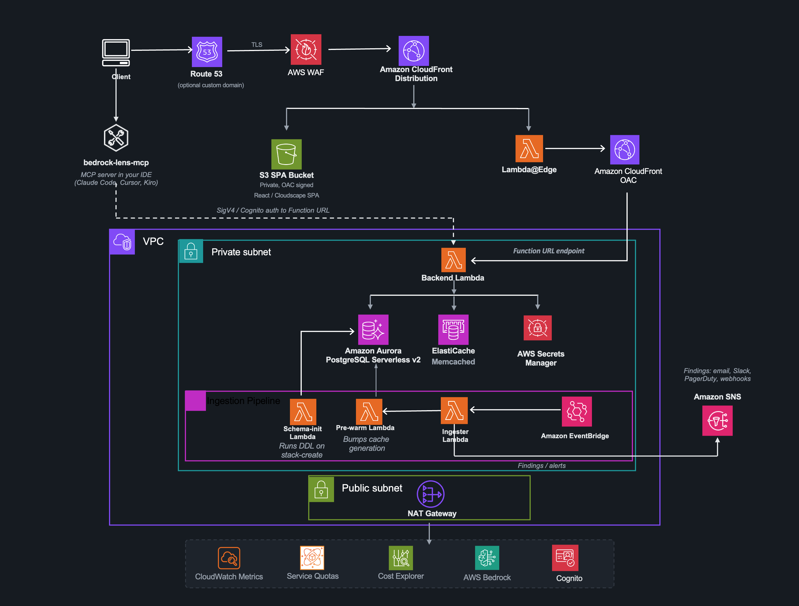

*Figure 1: Bedrock Ops Lens architecture - CloudFront-fronted React dashboard and Lambda backend, daily ingestion pipeline joining CloudWatch, Cost Explorer, Service Quotas, and invocation logs into Aurora, with the MCP server path for IDE access and Amazon SNS delivering findings and alerts.*

And this is what the dashboard looks like (per-tab screenshots are in [Screenshots](#screenshots) at the end of this README):

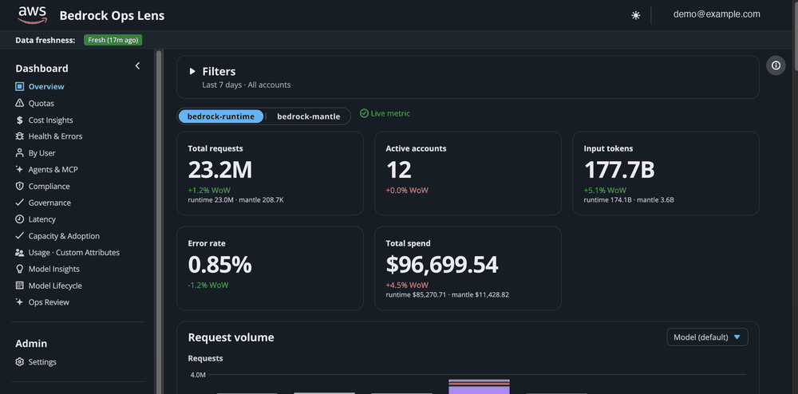

*Figure 2: Dashboard walkthrough - Overview, Cost Insights, Quotas, custom-attribute usage, Governance, By User, and the Ops Review, all populated with synthetic demo data.*


## Two ways to use it

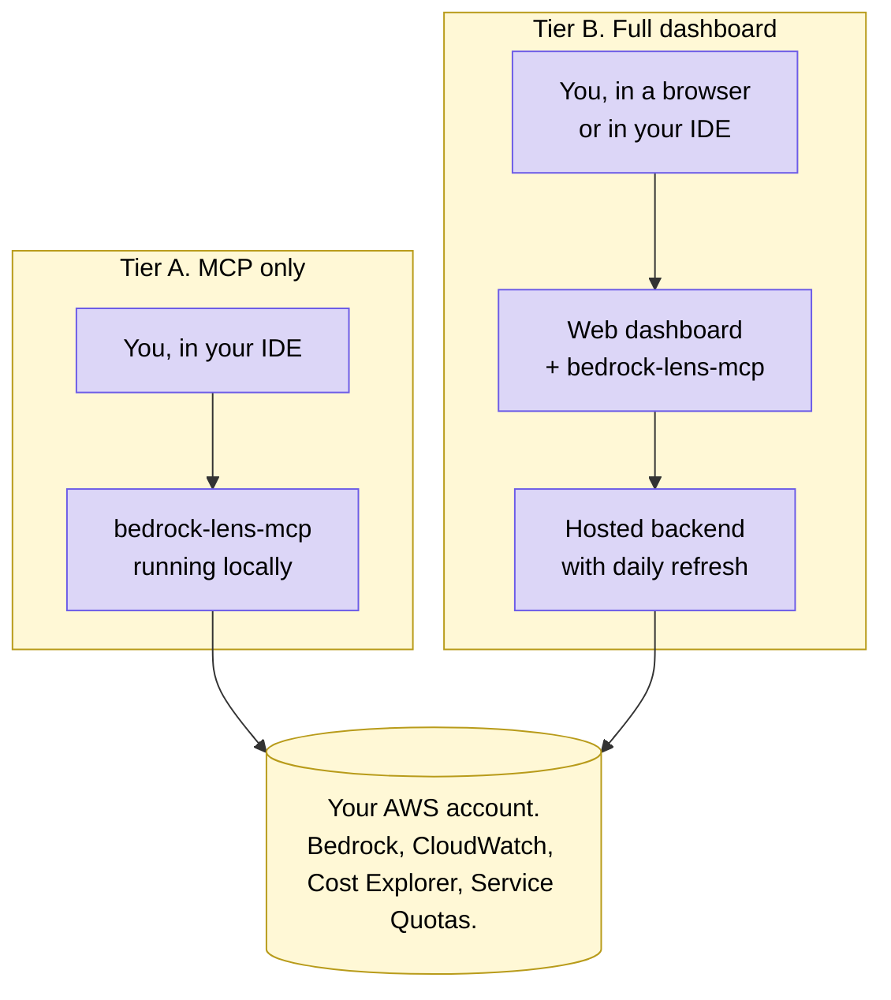
```mermaid
flowchart TB
    subgraph A["Tier A. MCP only"]
        direction TB
        A1["You, in your IDE"]
        A2["bedrock-lens-mcp<br/>running locally"]
        A1 --> A2
    end

    subgraph B["Tier B. Full dashboard"]
        direction TB
        B1["You, in a browser<br/>or in your IDE"]
        B2["Web dashboard<br/>+ bedrock-lens-mcp"]
        B3["Hosted backend<br/>with daily refresh"]
        B1 --> B2 --> B3
    end

    bottom[("Your AWS account.<br/>Bedrock, CloudWatch, Cost Explorer, Service Quotas.")]

    A2 --> bottom
    B3 --> bottom

    classDef tierBox fill:#fff8d6,stroke:#b89b1a,stroke-width:1px,color:#000
    classDef innerBox fill:#dcd6f7,stroke:#6c5ce7,stroke-width:1px,color:#000
    classDef sharedBox fill:#fff8d6,stroke:#b89b1a,stroke-width:1px,color:#000

    class A,B tierBox
    class A1,A2,B1,B2,B3 innerBox
    class bottom sharedBox
```

| Tier | Use it when |
|---|---|
| A. MCP only | You want quick answers in your IDE, no infrastructure. Cannot do heavy historical or tag-attributed work because there is no database. |
| B. Full dashboard | Finance, leadership, or anyone without AWS access needs the same insights. Includes the web UI and the MCP. |

Tier A is light. The MCP runs on your laptop and calls AWS APIs live. Useful for quick lookups but cannot do heavy historical work or per-tag cost attribution because there is no database behind it.

Tier B is everything else. The Cloudscape web dashboard, sign-in, CloudFront, daily ingester, Aurora, Memcached, and the same MCP wired up to talk to the hosted backend. Most teams deploy this so non-engineers can get the same insights without a terminal.


## Quick start

```bash
git clone https://github.com/aws-samples/sample-bedrock-ops-lens.git
cd sample-bedrock-ops-lens
cp config.example.yaml config.yaml      # then edit: deploy_region, monitored accounts/regions
ALLOWED_EMAIL_DOMAINS=yourcompany.com ./deploy.sh --yes
```

`config.yaml` is required (it drives the deploy region and which accounts/regions get monitored). Copy the example and edit it before deploying; the defaults work for a single-account, single-region setup.

The script handles everything: VPC, Aurora, Memcached, Cognito, CloudFront, WAF, schema, ingester, and a first ingest run. About 12 minutes. It prints the dashboard URL when done.

Open the dashboard URL and sign up. Anyone whose email domain matches `ALLOWED_EMAIL_DOMAINS` can create their own account; the first verified user is auto-promoted to admin.


## Wiring up the MCP

Install the MCP server first.

```bash
cd mcp
pipx install -e .
```

Pick the option that matches how you deployed.

<details>
<summary><b>Option 1. Tier A. No deployment, uses your local AWS credentials</b></summary>

Best for: a quick, solo setup. The MCP calls AWS directly.

```bash
claude mcp add bedrock-lens -- bedrock-lens-mcp
```

</details>

<details>
<summary><b>Option 2. Tier B, no password (recommended if you have AWS credentials)</b></summary>

Best for: anyone with AWS credentials who deployed the stack. Uses SigV4 signing so there is no Cognito password to manage.

```bash
FN_URL=$(aws cloudformation describe-stacks \
  --stack-name BedrockOpsLens-<suffix> \
  --query 'Stacks[0].Outputs[?OutputKey==`BackendLambdaUrl`].OutputValue' \
  --output text)

claude mcp add bedrock-lens \
  --env BEDROCK_LENS_FUNCTION_URL="$FN_URL" \
  -- bedrock-lens-mcp
```

</details>

<details>
<summary><b>Option 3. Tier B with a Cognito password (for users without AWS credentials)</b></summary>

Best for sharing access with someone who does not have AWS credentials. They sign in with email and password instead.

Set your credentials as environment variables first, then add the server. Do not commit the password.

```bash
export BEDROCK_LENS_API=https://<distribution>.cloudfront.net
export BEDROCK_LENS_USER=you@yourcompany.com
export BEDROCK_LENS_PASSWORD=...   # paste the password here, do not check it in

claude mcp add bedrock-lens \
  --env BEDROCK_LENS_API="$BEDROCK_LENS_API" \
  --env BEDROCK_LENS_USER="$BEDROCK_LENS_USER" \
  --env BEDROCK_LENS_PASSWORD="$BEDROCK_LENS_PASSWORD" \
  -- bedrock-lens-mcp
```

</details>

Then ask Claude something like:

> Run the bedrock-lens health check.

> What was our Bedrock spend last 30 days, and which day had the biggest jump?

> Are we using any models that are Legacy or about to hit EOL?

> Run an ops review of the last 14 days and summarize the top 3 issues.


## Daily refresh

After deploy, EventBridge invokes the ingester every day at 05:00 UTC. The ingester reads CloudWatch metrics, Cost Explorer, Service Quotas, Bedrock APIs, and Bedrock invocation logs from S3, then writes everything into Aurora and bumps the cache generation. Open the dashboard the next morning, yesterday's data is there.

Manual backfill if you change the schedule or want a fresh run:

```bash
aws lambda invoke \
  --function-name BedrockOpsLens-<suffix>-ingester \
  --invocation-type RequestResponse --cli-read-timeout 900 \
  /tmp/out.json
```


## Notifications and findings

An AI workload outage rarely starts as an outage. It starts as a quota creeping past
80%, a throttle rate inching up on one model, spend drifting above trend, or
traffic still running on a model that is 30 days from end-of-life. Each of
those is visible days before users feel it - but only if something is watching
all the accounts, all the time, and tells the right person. That is what this
does: it turns Bedrock Ops Lens from a place you *check* into a system that
*tells you*, so quota headroom has an owner even when nobody is looking at a
browser tab.

**What you get:** after each ingest, Bedrock Ops Lens evaluates the fresh data
against your thresholds and raises **findings** across four leading
indicators - quota utilization vs applied limits (burndown-weighted), throttle
rate per account/model/region, day-over-average cost jumps, and near-EOL
models with live traffic. Every finding arrives with a **prepared
remediation**: what to do, a ready-to-run CLI command, and a console deep link
(e.g. a pre-filled Service Quotas increase request). You review and execute it
yourself - Bedrock Ops Lens never modifies monitored accounts. Findings resolve
automatically when the condition clears, and notifications fire only on
open/resolve transitions, so a persistent condition alerts once, not daily.

**How to set it up:** findings always show in the bell menu (top navigation).
For delivery, an admin sets an SNS topic ARN under Settings → Notifications
and clicks "Send test notification" to verify. Email subscribers get a
readable digest; Lambda/webhook/EventBridge subscribers get structured JSON -
so Slack (via AWS Chatbot), PagerDuty, or ticketing hook in with no code
changes here. Any signed-in user can subscribe their own email from the same
page.

Why not just CloudWatch alarms? Signals like "peak TPM as % of the applied
quota" are joins across CloudWatch and Service Quotas - not single metrics -
and cost/lifecycle findings aren't CloudWatch metrics at all. One set of
thresholds here covers every monitored account. For minute-level thresholds on
one metric in one account, a native CloudWatch alarm remains the right tool;
the two are complements.


## Multi-account data pipeline

**Account names.** Tables show the account ID and account name as separate
columns (name resolves when available; CSV exports keep both fields separate
for machine processing). Dropdown labels show "name (ID)". Resolution order:
the optional `account_names` map in `config.yaml`
(always wins), the AWS Organizations account name (discover-org mode), then
`account:GetAccountInformation` asked of each account through the reader role
(works without Organizations; the permission ships in the reader-role
template). Unresolvable accounts simply show their ID.


The central Lambda pulls Bedrock data from every account you point it at. One script does the whole thing: it deploys a read-only `BedrockOpsLensReader` role into each account via a CloudFormation StackSet, reconfigures the central ingester to use those roles, and triggers the first ingest run synchronously so you see real data immediately.

```bash
./setup-pipeline.sh --scope <single|ou|org-root|accounts> [opts]
```

For Cost Explorer, no per-account role is needed at all - the management account's Cost Explorer is org-aware natively and the central Lambda calls it once.

<details>
<summary><b>Option 1. Just my own account (single)</b></summary>

The simplest case. No StackSet. Reader role deployed to the central account itself; ingester pulls from this one account.

```bash
./setup-pipeline.sh --scope single
```

</details>

<details>
<summary><b>Option 2. All accounts under one or more OUs (recommended for orgs)</b></summary>

Service-managed StackSet, deployed to the OUs you list. Auto-deploy is ON, so accounts joining the OU later are auto-onboarded. Run from the management account, or pass `--delegated-admin` from a delegated administrator account.

```bash
./setup-pipeline.sh --scope ou --ou-id ou-xxxx-yyyyyyyy
```

For multiple OUs, comma-separate them.

</details>

<details>
<summary><b>Option 3. Whole org root</b></summary>

Same as option 2 but targets every account in the organization. Useful for small orgs where OU-scoping isn't worth it.

```bash
./setup-pipeline.sh --scope org-root
```

</details>

<details>
<summary><b>Option 4. Explicit account list (no AWS Organizations)</b></summary>

Self-managed StackSet. Doesn't require AWS Organizations, but each member account needs the AWS-provided `AWSCloudFormationStackSetExecutionRole` pre-provisioned (one-time, per the [AWS docs](https://docs.aws.amazon.com/AWSCloudFormation/latest/UserGuide/stacksets-prereqs-self-managed.html)).

```bash
./setup-pipeline.sh --scope accounts \
  --accounts 111111111111,222222222222,333333333333
```

Or via file:

```bash
./setup-pipeline.sh --scope accounts \
  --accounts-file accounts.txt
```

</details>

The script is idempotent - re-run any time accounts are added or removed. Use `--dry-run` to preview without touching anything, `--skip-ingest` to skip the post-rollout ingest run.

### What `setup-pipeline.sh` does

1. Validates the central stack exists (auto-discovers from `.deploy-stack-name`).
2. Calls `scripts/setup-multi-account.py` to roll out the reader role via the right CloudFormation API for the chosen scope (service-managed StackSet for `ou` / `org-root`, self-managed for `accounts`, plain stack for `single`).
3. Reconfigures `MONITORED_ACCOUNTS_MODE` on the central ingester Lambda (`discover-org` for `ou`/`org-root`, `explicit` for `accounts`, `single` for `single`).
4. Triggers one ingest run synchronously and prints the per-module summary.

After this, EventBridge fires the ingester daily at 05:00 UTC. Re-run the script any time the OU shape changes.

### Scale

Validated end-to-end up to ~100 accounts in one ingester Lambda. Past that, the central Lambda starts hitting CloudWatch (50 TPS) and Service Quotas (5 TPS) per-account API limits.

For larger orgs (200+ accounts), shard by OU and run one StackSet per shard, each producing its own ingester:

```bash
./setup-pipeline.sh --scope ou --ou-id ou-engineering-...
./setup-pipeline.sh --scope ou --ou-id ou-data-...
./setup-pipeline.sh --scope ou --ou-id ou-experimental-...
```

For very large fleets (500+ accounts) the pull architecture becomes the wrong fit - the better pattern is push-mode (CW Metric Streams → Firehose → S3 → central ingester).


## Dashboard tabs

| Tab | Answer |
|---|---|
| Overview | Total requests, accounts, tokens, error rate, spend in the window |
| Quotas | Applied versus default quotas, peak usage, severity-coded utilisation |
| Cost Insights | Real Cost Explorer dollars, daily trend, by-account and by-model breakdowns |
| Health and Errors | Errors by model, by account, daily and hourly trends |
| Latency | p50, p90, p99 by model |
| Capacity and Adoption | CRIS adoption, throttle rates, prompt caching opportunities, Claude 4 burndown risk |
| Model Insights | Per-model deep dive: requests, tokens, cache hit rate, errors, accounts |
| Model Lifecycle | Live ListFoundationModels joined with usage, timeline of legacy and EOL bands |
| Workloads | Per-workload / per-user usage, throttle, and latency - **requires a GenAI proxy or client telemetry** (see below). Includes direct **anthropic-api / openai-api** traffic and a "Usage by provider" rollup across all paths. Also per-IAM-principal callers (from invocation logs) and per-project Mantle chargeback |
| By User | Per-caller attribution from invocation-log identity: by app/group (role), user (session), or full principal |
| Agents & MCP | AgentCore runtimes and MCP gateway tools: invocations, sessions, errors, latency, real billed cost |
| Compliance | Guardrails interventions by policy type, guardrail, and daily trend |
| Governance | Declarative registry (`db/registry.yaml`) reconciled against observed usage: compliant, drift, undeclared (shadow AI) |
| Ops Review | An AI agent reviews the fleet's findings and writes an executive brief covering the top 3 issues |
| Settings | Auth identity, ingestion freshness, region and account scope, pinned tag keys |

Two notes on the By User tab. The "user" axis is the `sts:AssumeRole` session name, which the caller chooses - it is audit-grade only if you enforce it (IAM condition on `sts:RoleSessionName`, or IAM Identity Center federation, which pins it to the login); the "group" axis (the role itself) cannot be faked. And since it shows person-level usage to every signed-in user, check your organization's privacy requirements before enabling broad access.

Every tab except **Workloads** populates automatically from CloudWatch, Cost
Explorer, Service Quotas, and (optionally) model invocation logs - no
application changes required. The Workloads tab is opt-in and needs the setup
below.


## Which attribution source when?

Bedrock Ops Lens has several ways to answer "who / what is driving usage" -
deliberately, because they differ in coverage and trust. Quick guide:

| You want to know… | Look at | Data source | Trust level | Needs |
|---|---|---|---|---|
| Which **team/person** called Bedrock (audit-friendly) | **By User** tab | Invocation-log `identity.arn` | AWS-witnessed | Invocation logging on |
| Usage by **workload / env / cost-center** (no proxy) | **Custom Attributes** tab (tags source) | Invocation-log `requestMetadata` | AWS-witnessed | Logging on + callers tag requests |
| Usage by any attribute **incl. throttle / latency / quota** | **Custom Attributes** tab (proxy source) | Proxy / client events | Client-reported | Gateway (e.g. LiteLLM callback) or OTEL emitter |
| Per-person **throttle, TTFT, retries, est. cost** | **Custom Attributes** tab, pivot by `user` | Proxy / client events | Client-reported | Emitter sends `user` dim |
| **Mantle** or **direct Anthropic/OpenAI API** traffic | **Custom Attributes** tab (+ By-Provider panel) | Client events only | Client-reported | Emitter (AWS-side sources can't see this) |
| Real **dollars** by account/service | **Cost Insights** tab | Cost Explorer | AWS-billed | Nothing |

Rules of thumb: **AWS-witnessed** sources (logs, CloudWatch, Cost Explorer)
are what finance and audits should use - they can't be spoofed, but they only
see bedrock-runtime. **Client-reported** sources see everything the client
experienced - retries, TTFT, Mantle, direct APIs - but only for instrumented
traffic, and the numbers are self-reported (the UI labels them). The two are
complements: same question, different halves of the truth. It's normal to
run both.

## Workloads: per-workload attribution and client telemetry (optional)

The Workloads tab answers **"which of my use-cases is driving usage, throttling,
and latency"** - CloudWatch can't, because it's keyed by model, not by your
application. It needs a shared layer in front of your model calls (LiteLLM, a
gateway, an SDK wrapper) that emits **one metadata-only event per request** to
S3. No proxy layer → this tab stays empty; everything else works normally.

**What you get:** pivot usage by any attribute you emit (`workload`, `env`,
`team`, `cost_center`, …) with tokens, throttle rate, latency, and TPM quota
utilization per value. Events can also cover traffic AWS-side sources can't
see: `bedrock-mantle` latency/TTFT and direct `anthropic-api` / `openai-api`
calls, rolled up in a "Usage by provider" view. These numbers are
**client-reported** (the UI labels them); AWS-metered sources stay the
billing/quota truth.

### Setup (3 steps)

1. **Emit events.** Easiest: already on LiteLLM? Drop in the ready-made
   callback from [`tools/client-telemetry/`](tools/client-telemetry/) (also
   has OTEL-collector and Claude Code on-ramps). Building your own? Copy
   `tools/reference-proxy/` - one NDJSON line per request to:

   ```
   s3://<your-bucket>/proxy-events/<region>/<YYYY>/<MM>/<DD>/<HH>/*.jsonl
   ```
   ```json
   {"ts":"2026-07-04T18:03:22Z",
    "dimensions":{"workload":"flights-search","env":"prod","business_unit":"travel"},
    "model":"anthropic.claude-opus-4-8","endpoint":"runtime","region":"us-east-1",
    "input_tokens":812,"output_tokens":143,"cache_read_tokens":0,
    "status":200,"throttled":false,"latency_ms":940,"request_id":"msg_..."}
   ```

   `dimensions` holds whatever attributes you slice by. `endpoint` is
   `runtime`, `mantle`, `anthropic-api`, or `openai-api`. Optional `ttft_ms`,
   `retry_attempts`, `cost_usd_est` enable the TTFT, retry, and estimated-cost
   columns. Metadata only - no prompt or response text ever leaves your proxy.

2. **Grant read access** - bucket policy allowing the ingester role
   `s3:GetObject` + `s3:ListBucket` on `.../proxy-events/*` (read-only,
   cross-account supported; Bedrock Ops Lens never sits in your request path).

3. **Deploy pointing at the bucket:**
   ```bash
   export PROXY_EVENTS_BUCKET=your-genai-proxy-events
   export PROXY_EVENTS_REGIONS=us-east-1,us-west-2
   ./deploy.sh --yes
   ```
   Leave `PROXY_EVENTS_BUCKET` unset to disable the tab entirely.

### How this relates to AWS-native attribution

AWS's native mechanisms ([Bedrock cost
management](https://docs.aws.amazon.com/bedrock/latest/userguide/cost-management.html))
answer **dollars** by principal / inference profile / Mantle Project - and this
toolkit uses them where they fit. What they don't emit is **throttle rate,
latency, or TPM quota utilization per workload**, and they don't cover
non-Bedrock traffic. The two paths are complements:

| | AWS-native (`requestMetadata` tags) | Proxy / client events |
|---|---|---|
| Setup | Tag calls + invocation logging on - no proxy | Emitter (LiteLLM callback, OTEL, or your gateway) |
| Coverage | `bedrock-runtime` only | runtime + mantle + direct Anthropic/OpenAI APIs |
| Metrics | Tokens + volume | + throttle %, latency, TTFT, retries, quota %, est. cost |
| Freshness | Daily batch | ~Hourly |
| Trust | AWS-witnessed | Client-reported |

Already running invocation logging with tagged requests? You get
usage-by-attribute with zero proxy work - pick "Option 1" in Settings. Want
throttle/latency/quota per workload or non-Bedrock coverage? Emit events -
"Option 2". Running both is normal.

> **Transport note:** the event shape is transport-agnostic; S3 NDJSON is the
> supported transport today (simplest cross-account read-only access, no
> per-metric cardinality cost). CloudWatch Logs / custom-metric readers could
> be added without changing the data model.


## Cost

Idle, with Aurora paused, the stack runs around fifty dollars per month. NAT Gateway is the largest fixed cost at about thirty-two. Aurora is between zero and forty-five depending on activity. ElastiCache Memcached is about thirteen. Lambda, CloudFront, S3, Cognito, and WAF together are around five.


## Verify

```bash
DASH_URL=$(aws cloudformation describe-stacks \
  --stack-name BedrockOpsLens-<suffix> \
  --query 'Stacks[0].Outputs[?OutputKey==`DashboardUrl`].OutputValue' \
  --output text)

curl -sf "$DASH_URL/api/health"
```

For end-to-end UI validation:

```bash
cd frontend
DASH_URL="$DASH_URL" \
TEST_EMAIL="you@yourcompany.com" \
TEST_PASS="$BEDROCK_LENS_PASSWORD" \
  npx playwright test tests/deployed-smoke.spec.js --project=chromium --reporter=list
```


## Local development

```bash
docker compose up -d
psql -d bedrock_lens -f db/schema.sql
psql -d bedrock_lens -f db/partitions.sql
cd backend && PYTHONPATH=.. uvicorn app.main:app --port 8001
cd frontend && npm install && npm run dev
```

Frontend at http://localhost:5173. Same FastAPI app and same ingester code that runs in Lambda runs locally under uvicorn.


## Tear down

```bash
./deploy.sh destroy
```

Cognito User Pool and the SPA bucket survive the delete on purpose, so re-deploys don't reset users. Delete them by hand if you want a fully clean account.


## License

MIT License. See `LICENSE` for details.

## Screenshots

> **Note:** All screenshots below show **synthetic demo data** generated by
> `db/seed.py` - every account ID, account name, application, user, and metric
> is invented for demonstration. No real AWS accounts or customer data appear
> in any image.

### Overview
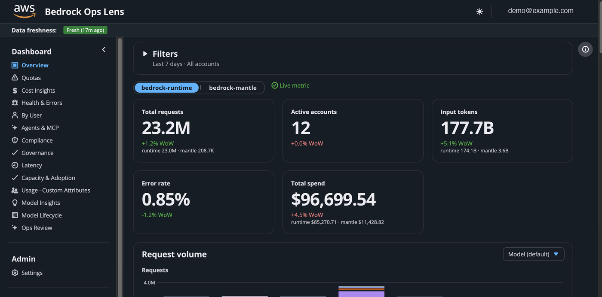

*Figure 3: Overview tab showing fleet-wide KPI tiles and a 7-day request volume breakdown by model across all accounts*

### Quotas
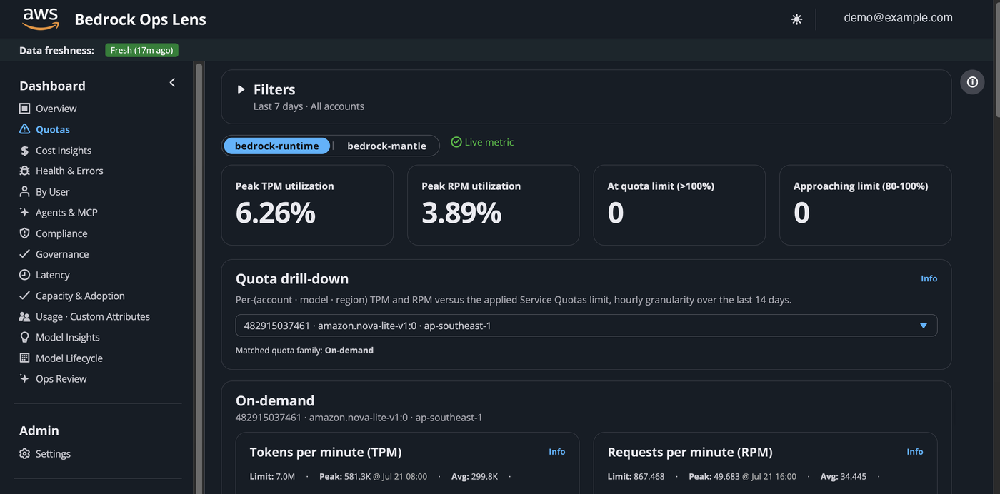

*Figure 4: Quotas tab comparing peak TPM/RPM against applied Service Quotas limits, with a filterable utilization table per account and model*

### Cost Insights
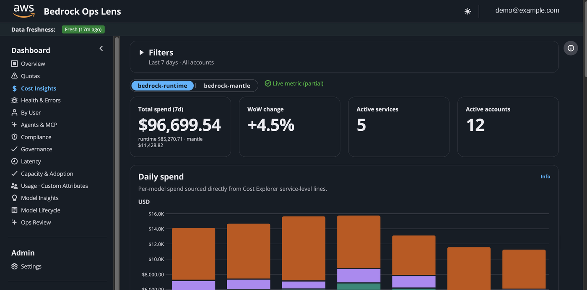

*Figure 5: Cost Insights tab with daily spend stacked by model family and a per-model cost breakdown table*

### Health & Errors
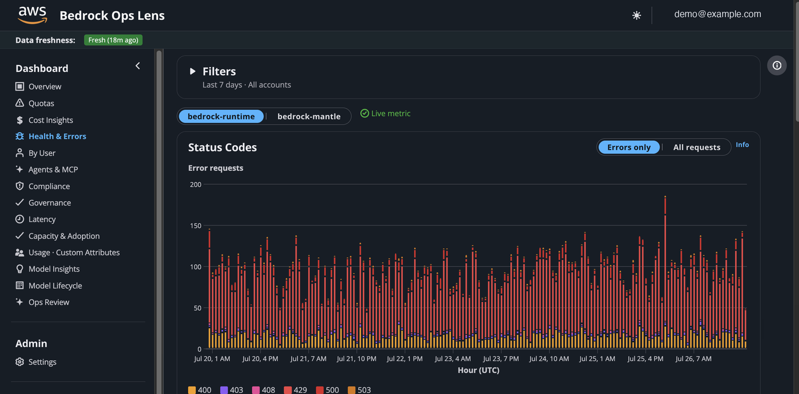

*Figure 6: Health & Errors tab with status-code timeline, throttle vs. server-error stacked area, and fleet-wide error-rate trend*

### Latency
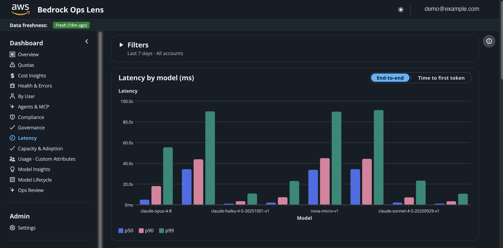

*Figure 7: Latency tab showing end-to-end latency by model at p50/p90/p99 with a sortable details table*

### Capacity & Adoption
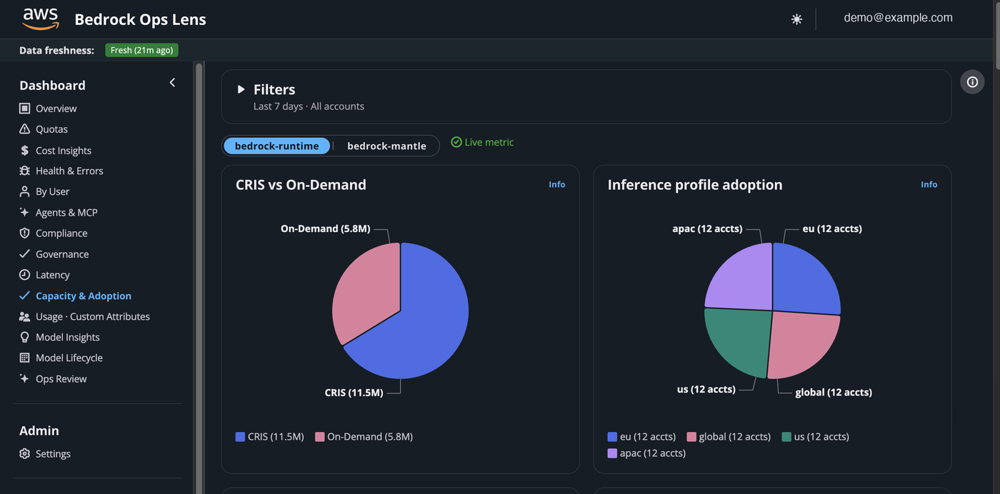

*Figure 8: Capacity & Adoption tab with CRIS vs. On-Demand breakdown, regional distribution, per-model adoption table, and adoption trend*

### Model Lifecycle
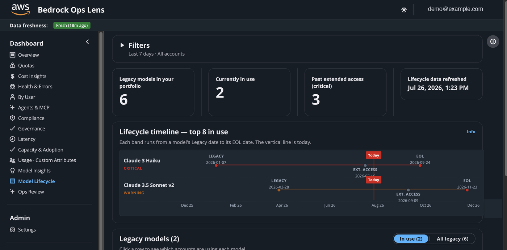

*Figure 9: Model Lifecycle tab tracking legacy, extended-access, and end-of-life milestones for models still receiving traffic*

### Model Insights
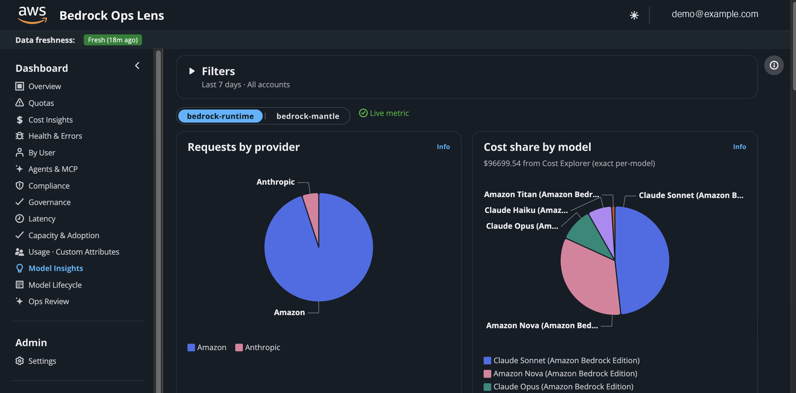

*Figure 10: Model Insights tab with provider share, spend-by-model-family breakdown, and per-model deep-dive*

### Usage · Custom Attributes
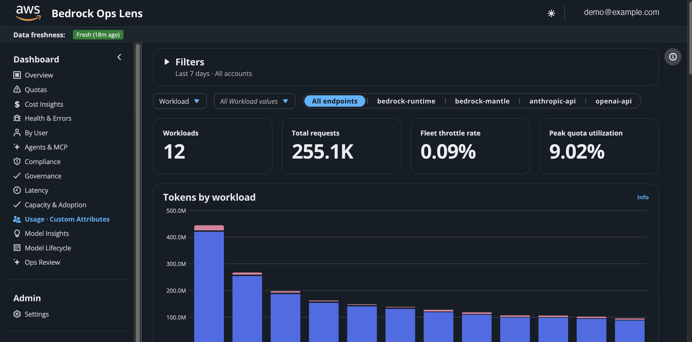

*Figure 11: Usage · Custom Attributes tab with the endpoint switcher (bedrock-runtime, bedrock-mantle, anthropic-api, openai-api) and per-workload token consumption*

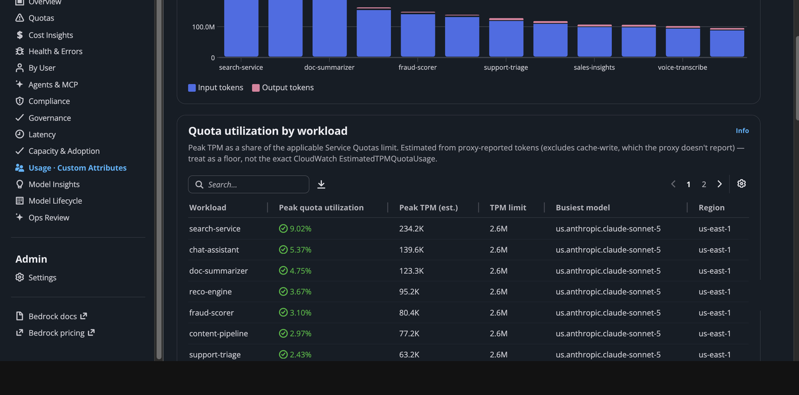

*Figure 12: Usage · Custom Attributes tab showing per-workload quota utilization and the detailed usage table from client-reported telemetry*

### By User / App / Principal
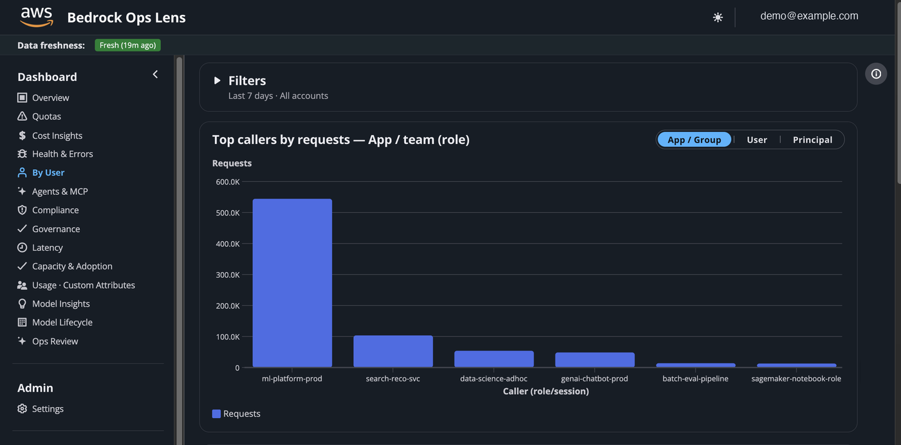

*Figure 13: By User tab ranking top callers by request volume, pivotable by App/Group, User, or IAM Principal*

### Agents & MCP
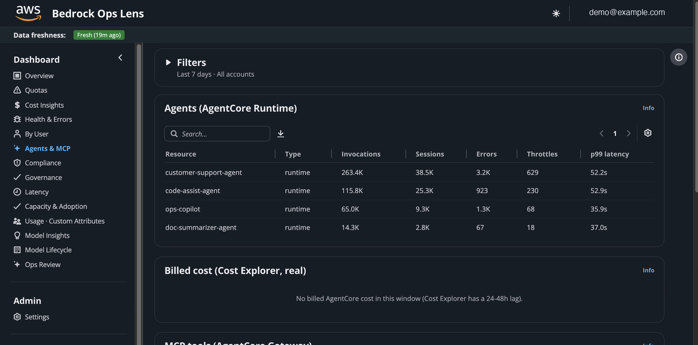

*Figure 14: Agents & MCP tab with AgentCore runtime inventory and MCP tool invocations, sessions, errors, and latency*

### Compliance (Guardrails)
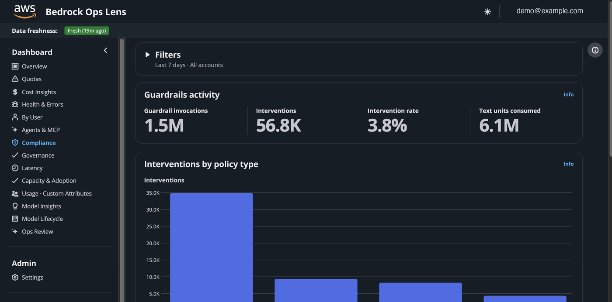

*Figure 15: Compliance tab with Guardrails intervention counts by policy type and a per-guardrail detail table*

### Governance
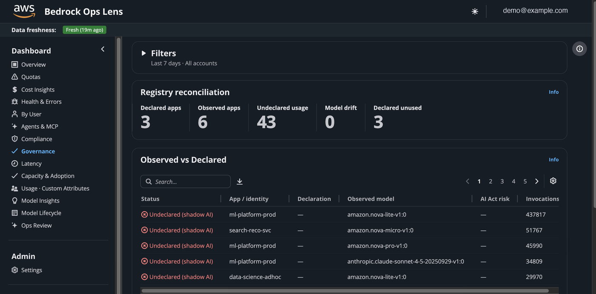

*Figure 16: Governance tab reconciling the declared AI-app registry against observed usage to surface undeclared shadow-AI traffic*

### Ops Review (AI Agent)
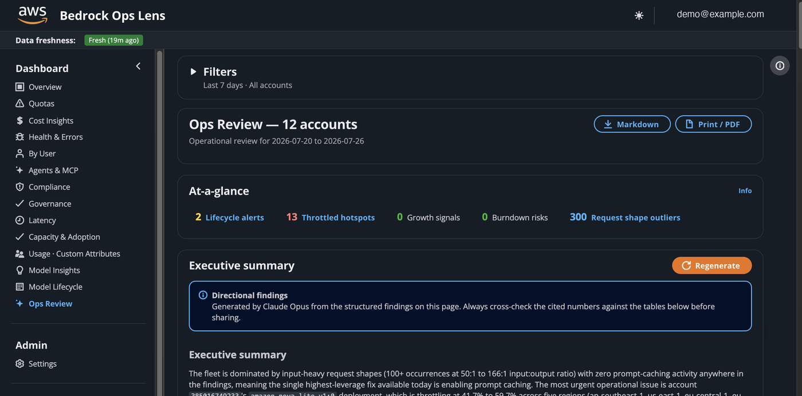

*Figure 17: Ops Review tab with the at-a-glance ribbon and an executive summary written by the Ops Review AI agent, grounded in fleet telemetry*
