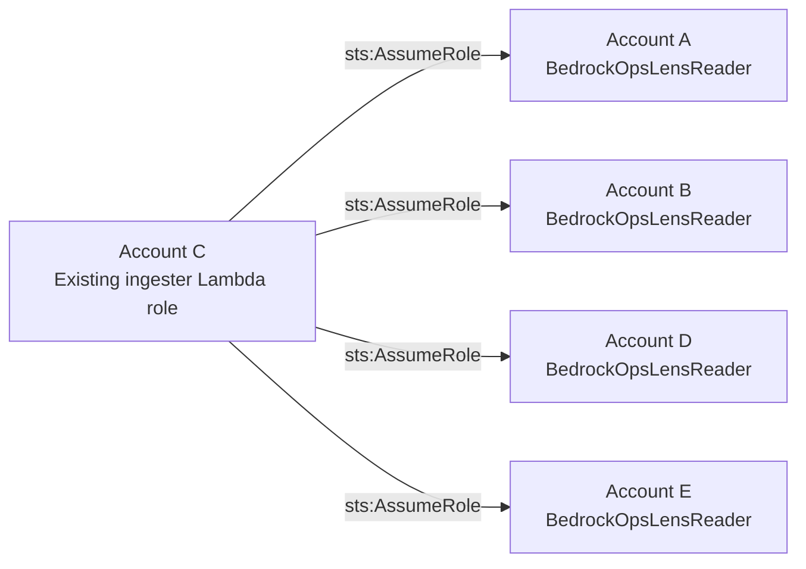

# Multi-account ingestion with roles managed by each account owner

[Home](../README.md#multi-account-data-pipeline) · [Choose an account scope](account-scope.md) · [StackSet alternative](multi-account-setup.md)

Use this route when account owners deploy IAM roles themselves, including when
AWS Organizations or CloudFormation StackSets cannot be used. Roles can be
managed through each account's approved IAM, Terraform, or CloudFormation
workflow. Account count does not determine which deployment method is permitted.

After the roles exist, configure the central ingester with:

```bash
./setup-pipeline.sh --scope accounts --accounts-file accounts.txt --skip-rollout
```

`--skip-rollout` makes no StackSet or IAM deployment calls. It preserves the
script's account validation, Lambda environment preservation, revision checks,
and ingestion-result checks. It does not create or update target roles.

## Accounts A–E, with C as central

The following account IDs are illustrative:

These examples use the default reader name, `BedrockOpsLensReader`. For a
different name, follow the [custom reader-role instructions](multi-account-setup.md#custom-reader-role-name)
and replace the reader name in the target deployment and inspection commands.

| Account | ID | Role needed for cross-account ingestion |
|---|---|---|
| A | `111111111111` | `BedrockOpsLensReader`, trusting C's ingester role |
| B | `222222222222` | `BedrockOpsLensReader`, trusting C's ingester role |
| C, central | `333333333333` | The existing `IngesterLambdaRole` created by the Lens deployment |
| D | `444444444444` | `BedrockOpsLensReader`, trusting C's ingester role |
| E | `555555555555` | `BedrockOpsLensReader`, trusting C's ingester role |



C obtains temporary credentials for each target reader role and uses its read
permissions. No `AWSCloudFormationStackSetAdministrationRole` or
`AWSCloudFormationStackSetExecutionRole` is needed. C's ingester role continues
to trust the Lambda service; target accounts do not need permission to assume it.

Three parts must agree:

1. C's ingester **permissions policy** allows `sts:AssumeRole` on the target
   reader-role ARNs.
2. Each target reader's **trust policy** allows C's actual ingester IAM role ARN.
3. Each target reader's **permissions policy** allows the data reads.

The [reader template](../infra/monitored-account-role.yaml) supplies the target
trust and read permissions: CloudWatch metrics, Service Quotas, selected Bedrock
configuration/model APIs, and account-name lookup. It grants no model invocation
or IAM administration permissions.

## 1. Prepare the central deployment in C

Follow the [central-deployment prerequisites](deployment.md#prerequisites). If Organizations must not
be used, disable it when deploying C:

```bash
AWS_PROFILE=lens-account-c ENABLE_ORGANIZATIONS_DISCOVERY=false \
  SKIP_INITIAL_INGEST=1 ./deploy.sh --yes
```

This sets the CloudFormation parameter `EnableOrganizationsDiscovery=false`,
omits Organizations permissions from the ingester, and starts it in
single-account mode. The initial ingest is skipped while target owners prepare
their roles. A scheduled run during preparation stays in C.

For an existing central installation, deploy the updated template/image with
the same setting. Changing only `config.yaml` is insufficient because Lambda's
environment takes precedence. Subsequent `deploy.sh` runs preserve the existing
discovery setting when the environment override is omitted. Re-run the manual
setup command after a central redeployment to restore the explicit account list.

The central stack and ingester role must exist **before** target owners create
trust policies referencing that role. IAM can reject a nonexistent trusted role
with `Invalid principal in policy`; this also applies to manual deployment.

## 2. Obtain C's actual runtime role and external ID

Run in C, replacing the stack name and Region with the deployed values:

```bash
LENS_STACK_NAME=BedrockOpsLens-example
LENS_REGION=us-east-1

CENTRAL_ACCOUNT_ID="$(aws sts get-caller-identity \
  --profile lens-account-c --query Account --output text)"

CENTRAL_INGESTER_ROLE_ARN="$(aws lambda get-function-configuration \
  --profile lens-account-c --region "$LENS_REGION" \
  --function-name "${LENS_STACK_NAME}-ingester" --query Role --output text)"

LENS_EXTERNAL_ID="$(aws lambda get-function-configuration \
  --profile lens-account-c --region "$LENS_REGION" \
  --function-name "${LENS_STACK_NAME}-ingester" \
  --query 'Environment.Variables.BEDROCK_OPS_LENS_EXTERNAL_ID' --output json \
  | python3 -c 'import json,sys; print(json.load(sys.stdin) or "")')"

printf '%s\n' "CentralAccountId=$CENTRAL_ACCOUNT_ID" \
  "CentralIngesterRoleArn=$CENTRAL_INGESTER_ROLE_ARN" \
  "ExternalId=$LENS_EXTERNAL_ID"
```

Give these values to the owners of A, B, D, and E. The principal must be the
ingester's IAM **role ARN**, not a Lambda function ARN, an STS assumed-role
session ARN, or the setup operator's identity.

An external ID is optional. If the target trust requires one, the ingester must
send the matching value. Use a consistent value across the target roles because
this ingester has one `BEDROCK_OPS_LENS_EXTERNAL_ID` setting.

## 3. Each target owner creates the reader role

The owner of A performs the following with **A's credentials**, using the three
values obtained from C. Owners of B, D, and E repeat it with their own credentials.
This example uses an ordinary CloudFormation stack in each target; it does not
use StackSets or require central credentials in the target account.

```bash
# Set these from C's output. The example ARN must be replaced with the actual ARN.
CENTRAL_ACCOUNT_ID=333333333333
CENTRAL_INGESTER_ROLE_ARN=arn:aws:iam::333333333333:role/REPLACE_WITH_ACTUAL_INGESTER_ROLE
LENS_EXTERNAL_ID=''  # replace if C uses an external ID

aws sts get-caller-identity --profile lens-account-a --query Account --output text

aws cloudformation deploy \
  --profile lens-account-a --region us-east-1 \
  --stack-name BedrockOpsLensReaderRole \
  --template-file infra/monitored-account-role.yaml \
  --parameter-overrides \
    "CentralAccountId=$CENTRAL_ACCOUNT_ID" \
    "CentralIngesterRoleArn=$CENTRAL_INGESTER_ROLE_ARN" \
    "RoleName=BedrockOpsLensReader" \
    "ExternalId=$LENS_EXTERNAL_ID" \
  --capabilities CAPABILITY_NAMED_IAM \
  --no-fail-on-empty-changeset
```

For console or Terraform deployment, use the same role name, trust principal,
optional external-ID condition, and permissions from the reader template.
`CentralIngesterRoleArn` must be supplied when using the template; its empty
default retains the older, broader central-account trust behavior.

Target owners need their normal IAM deployment permissions.
`CAPABILITY_NAMED_IAM` acknowledges named IAM resources; it grants no permissions.
There is no StackSet-specific `iam:PassRole` requirement. A customer's own
deployment pipeline may independently use a CloudFormation service role.

IAM roles are global within an account. Create the named reader once per target,
not once per monitoring Region. If that role already belongs to another
stack or pipeline, update it through its existing owner.

### Restricting C's assume-role permission

With the default `ReaderRoleName`, the central template permits `sts:AssumeRole`
on `arn:aws:iam::*:role/BedrockOpsLensReader`. Target trust still controls who can
enter each role. If your policy requires an exact account allowlist, have the
central deployment owner replace that statement with the approved ARNs:

```json
{
  "Effect": "Allow",
  "Action": "sts:AssumeRole",
  "Resource": [
    "arn:aws:iam::111111111111:role/BedrockOpsLensReader",
    "arn:aws:iam::222222222222:role/BedrockOpsLensReader",
    "arn:aws:iam::444444444444:role/BedrockOpsLensReader",
    "arn:aws:iam::555555555555:role/BedrockOpsLensReader"
  ]
}
```

Make that change in the central deployment's managed policy source so a later
deployment preserves it. Adding a narrower Allow alongside the existing wildcard
Allow does not restrict the wildcard. The monitored account list controls
collection; it is not an IAM permissions boundary.

## 4. Configure ingestion in C

Use Python 3 with `boto3` and AWS CLI v2. Run from the Lens checkout in C:

```bash
AWS_PROFILE=lens-account-c DEPLOY_REGION=us-east-1 \
  ./setup-pipeline.sh --scope accounts --skip-rollout \
  --accounts 111111111111,222222222222,444444444444,555555555555 \
  --dry-run
```

The preview reads the central stack and Lambda configuration. It does not
inspect or change target IAM roles, and does not prove runtime access.

Run the same command without `--dry-run` to configure and invoke the ingester:

```bash
AWS_PROFILE=lens-account-c DEPLOY_REGION=us-east-1 \
  ./setup-pipeline.sh --scope accounts --skip-rollout \
  --accounts 111111111111,222222222222,444444444444,555555555555
```

Or place the same IDs in `accounts.txt`, one per line:

```bash
AWS_PROFILE=lens-account-c DEPLOY_REGION=us-east-1 \
  ./setup-pipeline.sh --scope accounts --accounts-file accounts.txt --skip-rollout
```

C is not automatically included. Add `333333333333` if C's metrics should also
be monitored. The ingester uses its own credentials for C, so no reader role is
needed there for this manual route.

Setup discovers the stack from `.deploy-stack-name`; set `STACK_NAME_SUFFIX`
if using a different checkout. It sets explicit mode and the normalized account
IDs, preserves unrelated Lambda environment settings, and checks the revision
before updating. The reader name comes from the central stack's `ReaderRoleName`
parameter, which also controls its assume-role permission. Setup preserves a
custom name and rejects a conflicting `--role-name` assertion.
It preserves the current external ID unless
`BEDROCK_OPS_LENS_EXTERNAL_ID` is explicitly set; changing that value here does
not update target trust policies.

The central setup operator needs `cloudformation:DescribeStacks` on the central
stack and `lambda:GetFunctionConfiguration`, `lambda:UpdateFunctionConfiguration`,
and `lambda:InvokeFunction` on its ingester. This command does not require
Organizations, StackSet administration permissions, or access to target IAM APIs.

`--skip-ingest` configures the pipeline without testing ingestion. Use it only
when you intend to verify runtime access later.

## 5. Verify the runtime path and maintain access

Each target owner can inspect the deployed trust:

```bash
aws iam get-role --profile lens-account-a --role-name BedrockOpsLensReader \
  --query Role.AssumeRolePolicyDocument --output json
```

In C, inspect the real ingester's results and account/Region logs:

```bash
aws logs tail "/aws/lambda/${LENS_STACK_NAME}-ingester" \
  --profile lens-account-c --region "$LENS_REGION" --since 30m
```

Check A, B, D, and E individually. Investigate `AccessDenied`, `SKIP`, and module
failures. A budget-limited log pass reports incomplete coverage and can resume.
A trust-policy inspection or an administrator's STS call does not prove the
Lambda's runtime access.

For `Invalid principal in policy`, verify C's actual ingester role exists and
that its ARN was copied correctly. If C's role is deleted and recreated, target
owners must refresh trust; IAM records a role principal's ID, not just its name.

For a runtime denial, check both the target trust and C's assume-role permission,
the reader name, the external ID, and applicable explicit denies or permissions
boundaries.

When adding an account, its owner creates the reader and C re-runs setup with
the complete account list and `--skip-rollout`. Removing an ID stops future
collection; it does not revoke IAM trust or delete historical data. The target
owner handles trust removal through their existing IAM workflow.

Cost Explorer visibility and invocation-log delivery remain separate from
reader-role setup. See [billing, logging, and scaling limits](multi-account-setup.md#what-this-setup-does-not-configure)
and the [AWS cross-account IAM tutorial](https://docs.aws.amazon.com/IAM/latest/UserGuide/tutorial_cross-account-with-roles.html).
