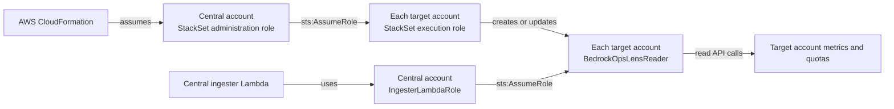

# Multi-account setup without AWS Organizations

[Home](../README.md#multi-account-data-pipeline) · [Choose an account scope](account-scope.md) · [Manual role deployment](manual-multi-account-setup.md)

Collect operational metrics and quotas from an explicit list of AWS accounts,
whether or not they belong to an AWS Organization. Choose the role-deployment
method your platform team permits:

* **Roles managed by each account owner:** follow the
  [manual multi-account guide](manual-multi-account-setup.md), then use
  `--scope accounts --skip-rollout`. This needs no StackSets, administration
  role, or execution roles.
* **Self-managed StackSets:** use `--scope accounts` without `--skip-rollout`
  and follow the remaining deployment steps in this guide. Each target owner
  must first install a StackSets execution role.

The script cannot grant itself access to another account. Both methods require
the target reader to trust the central ingester role.

This guide covers the Lambda deployment created by `deploy.sh`. Run the pipeline
script from the account containing that deployment, called the **central
account** below. The other accounts are **target accounts**.

## The two trust chains when using StackSets

Deployment permissions and ongoing data access use different roles:



| Role | Where it exists | Who can assume it | Who creates it |
|---|---|---|---|
| `AWSCloudFormationStackSetAdministrationRole` | Central account | AWS CloudFormation | Central administrator, once |
| `AWSCloudFormationStackSetExecutionRole` | Every target account | The central StackSets administration role | Each target administrator, once |
| The Lambda's `IngesterLambdaRole` | Central account; physical name generated by CloudFormation | AWS Lambda | `deploy.sh`, in the central stack |
| `BedrockOpsLensReader` | Every target account | The central ingester IAM role when set up by `setup-pipeline.sh` | The script's StackSet |

The person running setup uses their normal central-account deployment
credentials. They need permission to pass the administration role to
CloudFormation; they do **not** need to assume a target execution role or the
Lambda's role themselves.

During ingestion, the Lambda calls STS to obtain temporary credentials for each
target reader role. It does not use the StackSets administration or execution
role to collect data. Both sides must allow the call:

* The central ingester's identity policy allows `sts:AssumeRole` on the name
  selected by `ReaderRoleName`, defaulting to
  `arn:aws:iam::*:role/BedrockOpsLensReader`.
* The target reader's trust policy allows the central ingester's IAM role ARN.
  An optional external-ID condition must also match.

The reader policy allows CloudWatch metric reads, Service Quotas reads, selected
Bedrock configuration/model reads, and `account:GetAccountInformation`. It does
not allow model invocation or IAM administration. The complete policy is in
[`infra/monitored-account-role.yaml`](../infra/monitored-account-role.yaml).

## Custom reader role name

The examples use `BedrockOpsLensReader`. To use a different name for either
deployment route, configure the central stack with the same name as the targets:

```bash
AWS_PROFILE=lens-central ENABLE_ORGANIZATIONS_DISCOVERY=false \
  BEDROCK_OPS_LENS_ROLE_NAME=CompanyBedrockReader \
  SKIP_INITIAL_INGEST=1 ./deploy.sh --yes
```

This passes `ReaderRoleName=CompanyBedrockReader` to the central template. That
one parameter sets both the ingester's `sts:AssumeRole` resource and its
`BEDROCK_OPS_LENS_ROLE_NAME` environment variable. Redeployment preserves the
existing parameter when the environment override is omitted.

* **Manual target deployment (4b):** supply `RoleName=CompanyBedrockReader`
  to `infra/monitored-account-role.yaml` in each target.
* **Self-managed StackSets (4a):** supply `ReaderRoleName=CompanyBedrockReader`
  when each target owner deploys `infra/stackset-execution-role.yaml`. Its IAM
  permissions must authorize creation of that reader and its read policy.

`setup-pipeline.sh` reads the central parameter and uses it automatically.
Optionally assert the intended name:

```bash
AWS_PROFILE=lens-central DEPLOY_REGION=us-east-1 \
  ./setup-pipeline.sh --scope accounts --accounts-file accounts.txt \
  --role-name CompanyBedrockReader --skip-rollout
```

Omit `--skip-rollout` for StackSets. A conflicting `--role-name` or
`BEDROCK_OPS_LENS_ROLE_NAME` setting stops setup before rollout or a Lambda
update. Redeploy the central stack first when changing the permitted name.
Older central templates without `ReaderRoleName` permit only the default name.

The standalone `scripts/setup-multi-account.py --role-name` option deploys
target roles only; it does not change the central IAM policy or Lambda setting.
Changing a Lambda environment variable or `config.yaml` alone cannot grant
permission to assume a differently named role.

Changing the central parameter does not rename existing target roles.
Coordinate changes through their owning stacks or pipelines, then rerun setup;
scheduled ingestion needs the matching target roles to exist. Names must be
valid IAM role names without paths or wildcards.

## 1. Identify the accounts and central deployment

Examples below use **illustrative IDs**:

* Central account: `999999999999`, CLI profile `lens-central`.
* Targets: `111111111111` and `222222222222`, each with its own administrator profile.
* Central deployment Region: `us-east-1`.

Replace these values with your own. Profiles are existing AWS CLI credentials,
such as IAM Identity Center sessions; the repository does not create them.

In your checkout, confirm the central account and deployed stack:

```bash
LENS_STACK_NAME=BedrockOpsLens-example  # replace with your actual deployed name

aws sts get-caller-identity --profile lens-central --query Account --output text

# Use the actual stack name created by deploy.sh.
aws cloudformation describe-stacks \
  --profile lens-central --region us-east-1 \
  --stack-name "$LENS_STACK_NAME" \
  --query 'Stacks[0].StackStatus' --output text
```

Use Python 3 with `boto3` installed and AWS CLI v2. The StackSet is deployed in
one Region because IAM roles are global within an account; do not deploy the
same named reader role into multiple Regions. Data collection Regions are
configured separately through `monitored_regions` in `config.yaml`.

If Organizations must not be used, deploy the central stack with
`ENABLE_ORGANIZATIONS_DISCOVERY=false ./deploy.sh --yes`. This omits Organizations
permissions and starts the ingester in single-account mode. The explicit-account
setup below changes it to explicit mode after the readers are deployed.

## 2. Create the central StackSets administration role

If your platform team already manages the two standard StackSets roles, reuse
them after checking their trust and permissions. **Do not replace shared roles
with these templates:** restricting a shared role could break other StackSets.
If the IAM role already exists outside this bootstrap stack, CloudFormation will
report a name conflict rather than adopt it.

For a new setup, the central administrator runs:

```bash
aws cloudformation deploy \
  --profile lens-central --region us-east-1 \
  --stack-name BedrockOpsLens-StackSetAdministration \
  --template-file infra/stackset-administration-role.yaml \
  --parameter-overrides \
    "ExecutionRoleArns=arn:aws:iam::111111111111:role/AWSCloudFormationStackSetExecutionRole,arn:aws:iam::222222222222:role/AWSCloudFormationStackSetExecutionRole" \
  --capabilities CAPABILITY_NAMED_IAM \
  --no-fail-on-empty-changeset
```

The included [administration template](../infra/stackset-administration-role.yaml):

* Trusts `cloudformation.amazonaws.com`, with `aws:SourceAccount` and
  `aws:SourceArn` restricted to StackSets in the central account.
* Grants `sts:AssumeRole` only on the execution-role ARNs supplied above.

For a Region disabled by default, AWS requires its regional CloudFormation
service principal as well. Supply both principals using the template's
`CloudFormationServicePrincipals` parameter; see the
[AWS prerequisites](https://docs.aws.amazon.com/AWSCloudFormation/latest/UserGuide/stacksets-prereqs-self-managed.html).

## 3. Create the execution role in each target account

**Required order:** the central administration role from step 2 must exist
before any target creates its execution role. The execution-role trust names
that specific IAM role; IAM rejects a nonexistent principal with
`Invalid principal in policy`. Target owners can work in parallel after the
central role exists.

An administrator **of each target account** runs this command with credentials
for that target. `CentralAccountId` stays the same in every target:

```bash
aws cloudformation deploy \
  --profile lens-target-111111111111 --region us-east-1 \
  --stack-name BedrockOpsLens-StackSetExecution \
  --template-file infra/stackset-execution-role.yaml \
  --parameter-overrides CentralAccountId=999999999999 \
  --capabilities CAPABILITY_NAMED_IAM \
  --no-fail-on-empty-changeset
```

Repeat with profile `lens-target-222222222222` for the other target. The
[execution template](../infra/stackset-execution-role.yaml) trusts:

```json
{
  "Version": "2012-10-17",
  "Statement": [{
    "Effect": "Allow",
    "Principal": {
      "AWS": "arn:aws:iam::999999999999:role/AWSCloudFormationStackSetAdministrationRole"
    },
    "Action": "sts:AssumeRole"
  }]
}
```

Its permissions cover CloudFormation stack operations and IAM lifecycle
operations on **only** `BedrockOpsLensReader` and
`BedrockOpsLensReader-Read`. It does not attach `AdministratorAccess`.
CloudFormation stack permissions remain broad; have your platform team review
these deployment permissions under its normal IAM policy.

AWS's generic execution-role example grants administrator access. If using
that example instead, follow AWS's instruction to restrict its permissions to
the resources being deployed.

## 4. Authorize the person or automation running setup

Installing the service roles does not automatically grant the operator
permission to use them. The central setup identity needs:

| Purpose | Permissions |
|---|---|
| Inspect the central stack | `cloudformation:DescribeStacks` |
| Create/update the reader StackSet and its instances | `cloudformation:CreateStackSet`, `cloudformation:UpdateStackSet`, `cloudformation:CreateStackInstances` |
| Verify rollout, including every result page | `cloudformation:DescribeStackSet`, `cloudformation:DescribeStackSetOperation`, `cloudformation:ListStackSetOperationResults`, `cloudformation:ListStackInstances` |
| Check and pass the administration role | `iam:GetRole`, `iam:PassRole` on that role |
| Read/update the ingester configuration and run it | `lambda:GetFunctionConfiguration`, `lambda:UpdateFunctionConfiguration`, `lambda:InvokeFunction` on the central ingester |

For example, this **part** of the operator policy grants the role permissions:

```json
{
  "Version": "2012-10-17",
  "Statement": [{
    "Effect": "Allow",
    "Action": ["iam:GetRole", "iam:PassRole"],
    "Resource": "arn:aws:iam::999999999999:role/AWSCloudFormationStackSetAdministrationRole"
  }]
}
```

Your platform team supplies the remaining permissions from the table, scoped to
the central deployment where supported. The identities creating the prerequisite
roles in steps 2–3 also need CloudFormation deployment and IAM creation
permissions. The setup script does not grant these permissions to its caller.

## 5. Preview, then run the explicit-account setup

From the repository directory:

```bash
AWS_PROFILE=lens-central DEPLOY_REGION=us-east-1 \
  ./setup-pipeline.sh --scope accounts \
  --accounts 111111111111,222222222222 --dry-run
```

The preview validates the account list and reads the central stack and Lambda
configuration. It makes no changes, and it does not prove target-role access.

Run the same command without `--dry-run`:

```bash
AWS_PROFILE=lens-central DEPLOY_REGION=us-east-1 \
  ./setup-pipeline.sh --scope accounts \
  --accounts 111111111111,222222222222
```

Or create a file with one 12-digit ID per line. Blank lines and full-line `#`
comments are supported; invalid IDs are rejected:

```text
# accounts.txt
111111111111
222222222222
```

```bash
AWS_PROFILE=lens-central DEPLOY_REGION=us-east-1 \
  ./setup-pipeline.sh --scope accounts --accounts-file accounts.txt
```

Use exactly one account source. Duplicate IDs are deduplicated. The central
account is not automatically added to an explicit list. If you include it,
provision its execution role too; the script creates a StackSet instance for
every listed account, although ingestion uses its local Lambda credentials for
the central account itself.

The script uses `.deploy-stack-name` to find the central stack. If using another
checkout, set `STACK_NAME_SUFFIX` to the actual deployed suffix. It reads the
ingester's IAM role from Lambda and passes that ARN into the reader template;
there is no role ARN to guess or edit.

The script then:

1. Creates or updates the reader StackSet and adds missing target instances.
2. Checks every operation-result page and every requested account's instance
   status. A failed account stops setup, even if CloudFormation reports overall
   `SUCCEEDED` within a failure tolerance.
3. Sets `MONITORED_ACCOUNTS_MODE=explicit` and the same normalized CSV in
   `MONITORED_ACCOUNTS_IDS`, preserving unrelated Lambda environment variables.
4. Invokes the ingester and checks both Lambda function errors and the
   ingester's module results.

If invocation-log ingestion reaches its time budget, it records completed
objects and reports `status: incomplete` with the affected `incomplete_modules`.
Setup succeeds but explicitly reports incomplete data coverage; the remaining
objects can be processed by a later ingest run. Argument errors, empty account
discovery, and other module failures still stop setup.

For an existing installation, deploy the updated application image before
running the updated setup script. This script changes Lambda configuration;
it does not replace the ingester's code.

`--skip-ingest` performs setup without the immediate ingest; it explicitly leaves
runtime access and data collection unverified. Scheduled ingestion still uses
the central stack's EventBridge schedule.

### Optional external ID

If your IAM policy requires an external ID, set
`BEDROCK_OPS_LENS_EXTERNAL_ID` when running setup. The script applies the same
value to the reader-role trust condition and the Lambda environment. If the
variable is unset, it preserves the Lambda's existing value. Setting it to an
empty string removes that condition from both sides.

An external ID is an additional trust condition, not a replacement for the
principal ARN or the caller's `sts:AssumeRole` permission.

## 6. Verify access and data coverage

Verify the selected targets are `CURRENT` and their detailed statuses are
`SUCCEEDED`:

```bash
aws cloudformation list-stack-instances \
  --profile lens-central --region us-east-1 \
  --stack-set-name BedrockOpsLensReaderRole \
  --query 'Summaries[].{Account:Account,Region:Region,Status:Status,Detail:StackInstanceStatus.DetailedStatus}' \
  --output table
```

Check the Lambda scope without displaying its other environment variables:

```bash
aws lambda get-function-configuration \
  --profile lens-central --region us-east-1 \
  --function-name "${LENS_STACK_NAME}-ingester" \
  --query 'Environment.Variables.{Mode:MONITORED_ACCOUNTS_MODE,Accounts:MONITORED_ACCOUNTS_IDS}' \
  --output json

aws lambda get-function-configuration \
  --profile lens-central --region us-east-1 \
  --function-name "${LENS_STACK_NAME}-ingester" \
  --query Role --output text

aws iam get-role \
  --profile lens-target-111111111111 \
  --role-name BedrockOpsLensReader \
  --query 'Role.AssumeRolePolicyDocument' --output json

aws logs tail "/aws/lambda/${LENS_STACK_NAME}-ingester" \
  --profile lens-central --region us-east-1 --since 30m
```

Repeat the target-role query in each target account and confirm it names the
ingester role returned above. The target inspection identity needs `iam:GetRole`.
The log-reading identity needs CloudWatch Logs read permissions. In the logs,
check each expected account/Region pair and investigate `SKIP`, `AccessDenied`,
or module failures. An explicit `incomplete_reason: time_budget` indicates
resumable work; a nonzero return code alone does not. In the dashboard, check
Settings and an account with known recent Bedrock activity. No recent traffic
can legitimately produce no usage rows; a successful role deployment alone does
not prove data coverage.

An STS test using an administrator's laptop credentials is **not** a test of the
Lambda's access. With the restricted reader trust, that administrator may be
denied even though the ingester is allowed. Use the actual ingest run and its
per-account logs to verify the runtime principal.

## What this setup does not configure

* **Billing visibility:** Cost Explorer is called using the central account's
  credentials. A management/payer account can return its linked-account costs,
  subject to billing permissions. An arbitrary central account cannot retrieve
  unrelated accounts' bills merely because their reader roles exist. The reader
  role does not include Cost Explorer permissions, and this script does not add
  per-account billing collection.
* **Invocation logs and caller attribution:** the script does not enable logging
  in each target or grant delivery into a central S3 bucket. Configure invocation
  logging and destination bucket/KMS permissions separately when those views are
  needed. The reader role alone provides operational metrics and quotas.
* **Other workloads or model access:** the reader role does not allow the
  ingester to invoke models in targets.
* **Resource deletion:** removing an account from the explicit list stops future
  ingestion after reconfiguration; it does not remove its IAM role, StackSet
  instance, or historical rows.
* **Automatic sharding:** the script configures one existing central ingester.
  Repeating setup does not create additional ingester Lambdas.

Start with a few accounts and inspect run duration before expanding. Completion
depends on account count, selected Regions, API throttling, and available data;
the Lambda has a 15-minute execution limit. Re-run setup after central
redeployments that reset Lambda environment configuration.

## Troubleshooting and changes

| Symptom | Check |
|---|---|
| Missing `AWSCloudFormationStackSetAdministrationRole` | Create or reuse the central role in step 2, using credentials for the account containing the Lens stack. |
| `Invalid principal in policy` while creating the execution role | Complete step 2 first and verify the central administration-role ARN. For a manually deployed reader, the required existing principal is C's ingester role instead; see the manual guide. |
| `iam:PassRole` denied | Add the scoped operator permission from step 4. `CAPABILITY_NAMED_IAM` acknowledges IAM resources; it does not grant permissions. |
| Target execution role missing or cannot be assumed | The target administrator must complete step 3. Confirm the central administration role's target ARN list and the target execution role's trust. |
| IAM action denied while creating the reader | Check the execution-role policy against `monitored-account-role.yaml`, plus applicable permissions boundaries and SCPs. |
| Reader role already exists | Find its existing stack/StackSet owner. Update that owner or plan a migration; do not delete a shared role just to bypass the conflict. |
| StackSet operation is already running | Wait for completion, inspect its per-account results, then re-run. Setup must not configure ingestion based on an unfinished rollout. |
| Runtime `sts:AssumeRole` denied | Compare the Lambda's actual IAM role ARN with reader trust, its identity policy, any external ID, and applicable explicit denies. |
| Custom reader name fails at ingestion or setup reports a name mismatch | Match the central `ReaderRoleName`, target `RoleName`, and ingester environment. For self-managed StackSets, also match the execution template's `ReaderRoleName`. See the custom-name instructions above. |
| Lambda configuration revision conflict | Another update occurred during setup. Inspect it and re-run; setup does not overwrite a concurrent configuration update. |
| Ingest returns `partial` or times out | Inspect the failed module and account/Region logs. Fix access or reduce the workload before relying on coverage. |
| Metrics present but costs or caller identities missing | Check the billing and invocation-log limitations above. These use different data sources and permissions. |

To add an account, extend the administration role's allowed execution-role ARNs,
bootstrap the new target execution role, and re-run with the complete intended
account list. To revoke access, first remove the account from monitoring, then
have the platform team remove its StackSet instance/reader role after checking
for other users of that role. Historical data requires separate retention or
deletion handling.

When deploying the reader template manually, supply `CentralIngesterRoleArn`.
Its empty default preserves the older central-account trust behavior for
compatibility: `arn:aws:iam::<central-account>:root` delegates trust to that
account, whose principals also need an identity-policy grant. It does not mean
only the root user can assume the role. If a trusted IAM role is deleted and
recreated, have the administrators refresh the affected trust policies. IAM
stores direct role principals by ID, so recreating the same role name alone
does not restore that trust.

## References

* [AWS: Grant self-managed StackSets permissions](https://docs.aws.amazon.com/AWSCloudFormation/latest/UserGuide/stacksets-prereqs-self-managed.html)
* [AWS: Cross-account access using IAM roles](https://docs.aws.amazon.com/IAM/latest/UserGuide/tutorial_cross-account-with-roles.html)
* [AWS: StackSet operation preferences and failure tolerance](https://docs.aws.amazon.com/AWSCloudFormation/latest/APIReference/API_StackSetOperationPreferences.html)
* [Reader-role template](../infra/monitored-account-role.yaml)
* [Central administration-role bootstrap](../infra/stackset-administration-role.yaml)
* [Target execution-role bootstrap](../infra/stackset-execution-role.yaml)
